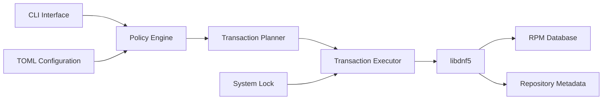
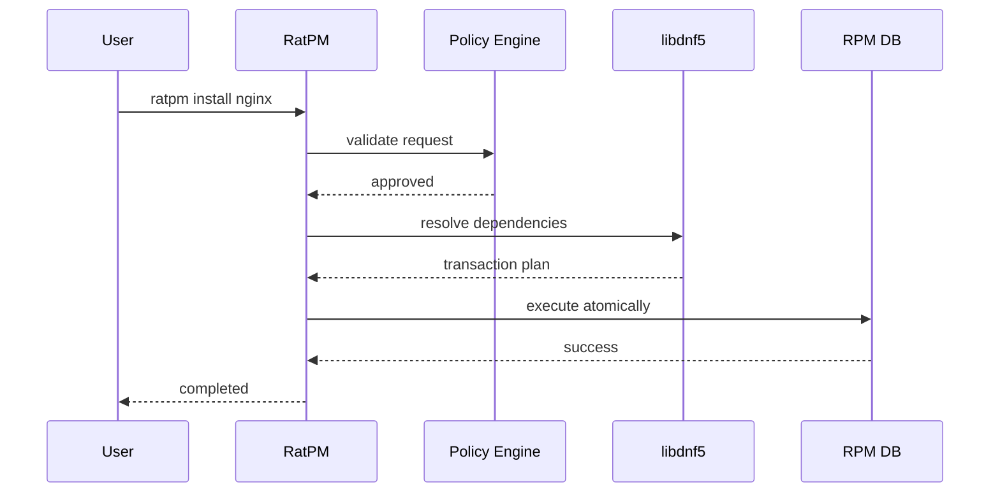
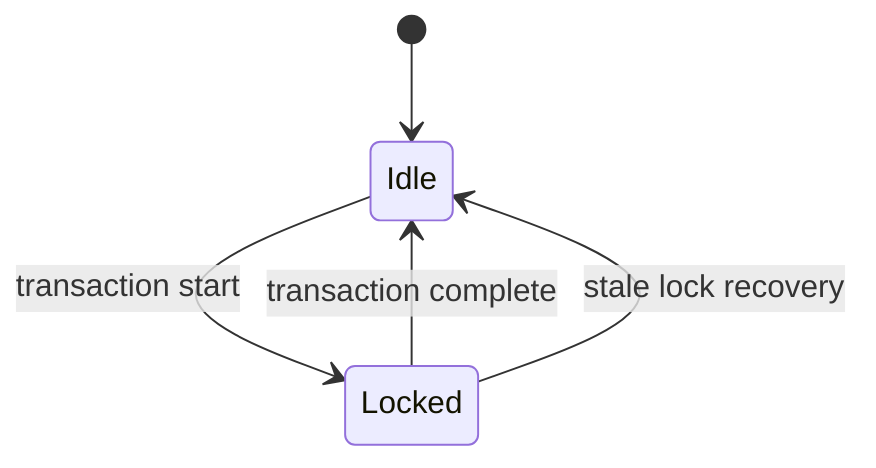
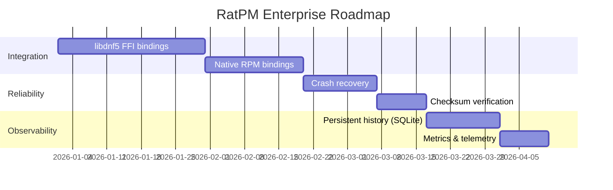

# RatPM — RatOS Package Manager

<div align="center">


<h1>RatPM</h1>
<h3>Enterprise-grade package management frontend for RatOS</h3>
<p>Policy-driven · Transaction-safe · Built on Fedora’s RPM ecosystem</p>

<br />

<p>


</p>
<p>


</p>

</div>

---

## Executive Summary

**RatPM** is the official package management frontend for **RatOS**, a Fedora‑based Linux distribution designed with enterprise‑grade guarantees and developer‑focused ergonomics.

RatPM provides a **policy enforcement and transaction orchestration layer** on top of proven Fedora technologies (**RPM**, **libdnf5**). It does **not** replace or fork existing package formats, dependency solvers, or repositories.

The result is a system that is:

* ✦ Predictable under failure
* ✦ Strict by default
* ✦ Transparent in operation
* ✦ Designed for long‑term maintainability

---

## Design Principles

* ✦ **Upstream first** — leverage Fedora, do not diverge unnecessarily
* ✦ **Policy over preference** — system rules are explicit and enforceable
* ✦ **Atomic by default** — no partial state, ever
* ✦ **Operational clarity** — every action is inspectable and auditable
* ✦ **Enterprise realism** — no hidden behavior, no magic

---

## High‑Level Architecture



### Component Responsibilities

| Component            | Responsibility                               |
| -------------------- | -------------------------------------------- |
| CLI                  | User interaction, argument validation        |
| Policy Engine        | Enforces system rules and safety constraints |
| Transaction Planner  | Builds deterministic transaction plans       |
| Transaction Executor | Applies plans atomically                     |
| libdnf5              | Dependency resolution & metadata handling    |
| RPM                  | Package installation and database management |

---

## Data & Control Flow



---

## Feature Overview

* ✦ Package installation, removal, and upgrades
* ✦ Deterministic transaction planning
* ✦ System‑wide locking and conflict prevention
* ✦ Repository synchronization and validation
* ✦ Diagnostic tooling (`ratpm doctor`)
* ✦ Structured error codes and audit‑friendly output

---

## Build & Installation

### Build

```bash
cargo build --release
```

### Install

```bash
sudo install -m 755 target/release/ratpm /usr/bin/ratpm
sudo mkdir -p /etc/ratpm
sudo cp ratpm.toml.example /etc/ratpm/ratpm.toml
```

---

## Configuration Model

### Locations

* System: `/etc/ratpm/ratpm.toml`
* User: `~/.config/ratpm/ratpm.toml`

### Example

```toml
[system]
backend = "fedora"
assume_yes = false
color = true
cache_dir = "/var/cache/ratpm"
lock_file = "/var/lock/ratpm.lock"

[repos]
auto_refresh = true
metadata_expire = 86400
repo_dir = "/etc/yum.repos.d"
gpgcheck = true

[transaction]
keep_cache = true
history_limit = 100
verify_signatures = true
```

---

## Command Surface

```text
ratpm install <packages>
ratpm remove <packages>
ratpm update
ratpm upgrade [packages]
ratpm search <query>
ratpm info <package>
ratpm list [--installed|--available]
ratpm sync
ratpm doctor
ratpm history [--limit N]
```

---

## Locking & Concurrency Model

RatPM enforces **single‑writer semantics** across the entire system using a global lock file:

```text
/var/lock/ratpm.lock
```



* ✦ Prevents concurrent RPM access
* ✦ Automatically cleans stale locks
* ✦ Guarantees database integrity

---

## Security Model

* ✦ Root privileges required for all mutating operations
* ✦ GPG verification for metadata and packages (when enabled)
* ✦ Atomic execution prevents partial installation states
* ✦ Scriptlet execution monitored and bounded

---

## Error Model

RatPM exposes **stable, machine‑readable exit codes**.

| Code | Description                        |
| ---- | ---------------------------------- |
| 0    | Success                            |
| 1    | General error or package not found |
| 2    | Dependency conflict                |
| 3    | Transaction check failed           |
| 4    | Transaction execution failed       |
| 5    | Network error                      |
| 6    | Repository error                   |
| 7    | Insufficient disk space            |
| 8    | Configuration error                |
| 9    | RPM database error                 |
| 10   | Scriptlet execution failed         |
| 13   | Permission denied                  |
| 14   | Lock held by another process       |

---

## Development Status

**Current version:** RatPM v1

### Implemented

* ✦ CLI interface
* ✦ Repository handling
* ✦ Transaction framework
* ✦ Lock management
* ✦ Structured error reporting

### Known Gaps

* libdnf5 FFI bindings are placeholders
* RPM operations use mock interfaces
* Download and scriptlet execution simulated
* Transaction history not persisted

---

## Production Readiness Roadmap



---

## Support, Stability & Lifecycle Policy

RatPM follows a **predictable, enterprise-aligned lifecycle model** inspired by Fedora and Red Hat tooling.

* ✦ **Stable CLI contract** — flags and exit codes are backward compatible within major versions
* ✦ **Strict semantic versioning** — breaking changes only in major releases
* ✦ **Long-term maintenance intent** — RatPM is designed to be maintained alongside RatOS base releases
* ✦ **Reproducible behavior** — identical inputs produce identical transaction plans

There is no silent behavior drift between releases.

---

## Compliance & Hardening Posture

RatPM is designed to be compatible with hardened and regulated environments.

* ✦ Deterministic execution suitable for **CIS-style audits**
* ✦ Clear privilege boundaries (explicit root-only mutation paths)
* ✦ No background services or daemons
* ✦ No automatic telemetry (opt-in only, future)

Future hardening targets include:

* ✦ FIPS-compatible cryptographic paths
* ✦ SELinux-aware transaction labeling
* ✦ Read-only root filesystem compatibility

---

## CLI Reference (Manpage-Style)

### SYNOPSIS

```text
ratpm [GLOBAL OPTIONS] <COMMAND> [ARGS]
```

### GLOBAL OPTIONS

```text
-y, --assume-yes      Automatically answer yes to prompts
--no-color            Disable colored output
--config <path>       Use alternate configuration file
--root <path>         Operate on an alternate root
--version             Show version information
```

### COMMANDS

```text
install     Install one or more packages
remove      Remove installed packages
upgrade     Upgrade packages or entire system
update      Refresh repository metadata
search      Search for packages
info        Display package metadata
list        List installed or available packages
sync        Synchronize package databases
doctor      Run system diagnostics
history     Show transaction history
```

All commands return deterministic exit codes suitable for scripting.

---

## Documentation & Specification Quality

RatPM documentation follows **system tooling standards**, not marketing copy.

* ✦ Every user-visible behavior is documented
* ✦ Error conditions are exhaustively enumerated
* ✦ Configuration schema is strict and validated
* ✦ Diagrams reflect actual control flow

Documentation is treated as part of the interface contract.

---

## License

GPL‑3.0‑or‑later

RatPM is free software, designed for systems that value correctness over convenience.

---

<div align="center">

RatOS Project — Infrastructure with intent

</div>
